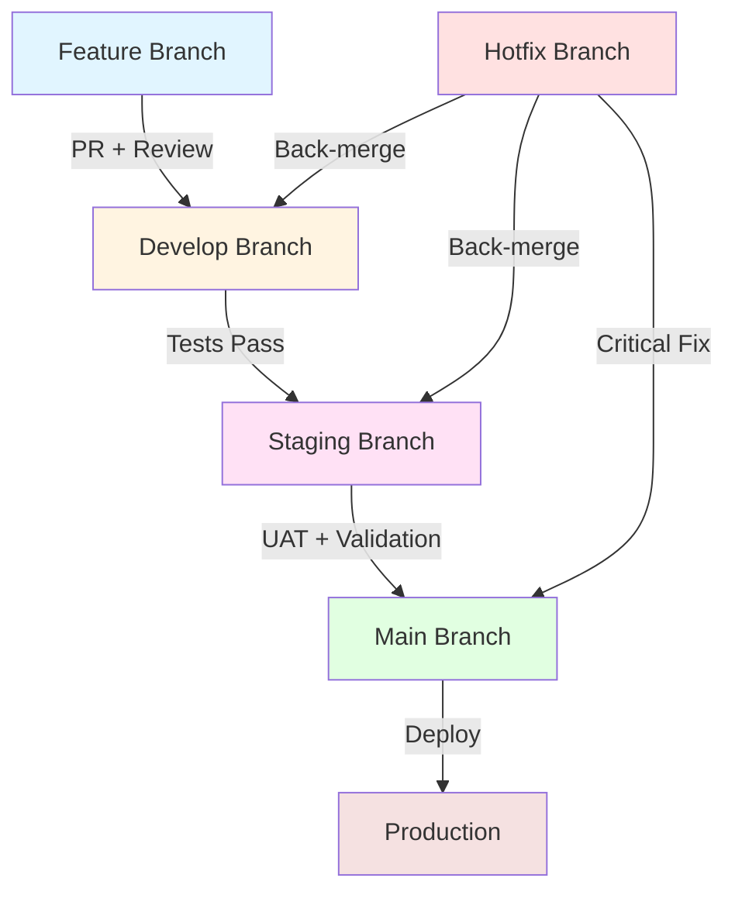

# Workflow Diagrams

Visual representations of development and deployment workflows for the PolySaaS project.

## Standard Development Workflow



## Branch Promotion Flow

```
Developer              Develop                 Staging                Main/Production
    │                     │                       │                        │
    │                     │                       │                        │
    ├─ Create Feature ───►│                       │                        │
    │                     │                       │                        │
    ├─ Develop & Test ────►│                       │                        │
    │                     │                       │                        │
    ├─ Create PR ─────────►│                       │                        │
    │                     │                       │                        │
    ├─ Code Review ───────►│                       │                        │
    │                     │                       │                        │
    │                     ├─ Merge ───────────────►│                        │
    │                     │                       │                        │
    │                     │                       ├─ Integration Tests     │
    │                     │                       │                        │
    │                     │                       ├─ UAT ────────────────►│
    │                     │                       │                        │
    │                     │                       │                        ├─ Deploy
    │                     │                       │                        │
    │                     │                       │                        ├─ Monitor
    │                     │                       │                        │
```

## Continuous Integration Pipeline

```
┌─────────────┐
│   Commit    │
└──────┬──────┘
       │
       ▼
┌─────────────┐
│    Lint     │──► ESLint, Prettier, Black
└──────┬──────┘
       │
       ▼
┌─────────────┐
│  Unit Tests │──► Jest, Pytest, PHPUnit
└──────┬──────┘
       │
       ▼
┌─────────────┐
│    Build    │──► Compile, Bundle
└──────┬──────┘
       │
       ▼
┌─────────────┐
│ Integration │──► API Tests, DB Tests
│    Tests    │
└──────┬──────┘
       │
       ▼
┌─────────────┐
│   Security  │──► SAST, Dependency Scan
│    Scan     │
└──────┬──────┘
       │
       ▼
┌─────────────┐
│   Deploy    │──► Staging/Production
└─────────────┘
```

## Git Branch Structure

```
main (production)
│
├── v1.0.0 (tag)
├── v1.0.1 (tag)
│
├── staging
│   │
│   ├── develop
│   │   │
│   │   ├── feature/user-auth
│   │   ├── feature/payment-integration
│   │   └── feature/dashboard
│   │
│   └── release/v1.1.0
│
└── hotfix/critical-bug
```

## Code Review Process

```
┌──────────────┐
│ Create PR    │
└──────┬───────┘
       │
       ▼
┌──────────────┐
│ Automated    │──► Lint, Test, Build
│ Checks       │
└──────┬───────┘
       │
       ▼
┌──────────────┐     ┌─────────────┐
│ Code Review  │────►│ Request     │
│              │     │ Changes     │
└──────┬───────┘     └──────┬──────┘
       │                    │
       │◄───────────────────┘
       │
       ▼
┌──────────────┐
│ Approve      │
└──────┬───────┘
       │
       ▼
┌──────────────┐
│ Merge        │
└──────────────┘
```

## Deployment Pipeline

```
┌────────────────────────────────────────────┐
│            Source Control                  │
│              (GitHub)                      │
└─────────────────┬──────────────────────────┘
                  │
                  ▼
┌─────────────────────────────────────────────┐
│         CI/CD (GitHub Actions)              │
├─────────────────────────────────────────────┤
│  • Checkout code                            │
│  • Install dependencies                     │
│  • Run tests                                │
│  • Build artifacts                          │
│  • Security scan                            │
└─────────────────┬───────────────────────────┘
                  │
                  ▼
┌─────────────────────────────────────────────┐
│          Artifact Storage                   │
│        (Docker Registry / S3)               │
└─────────────────┬───────────────────────────┘
                  │
                  ▼
┌─────────────────────────────────────────────┐
│            Deployment                       │
├─────────────────────────────────────────────┤
│  Development  →  Staging  →  Production     │
└─────────────────────────────────────────────┘
```

## Release Management

```
Develop                    Release                    Main
   │                          │                        │
   │──── Code Freeze ────────►│                        │
   │                          │                        │
   │                          ├─ Version Bump          │
   │                          ├─ Update Changelog      │
   │                          ├─ Final Tests           │
   │                          │                        │
   │                          ├─────── Merge ─────────►│
   │                          │                        ├─ Tag Release
   │                          │                        ├─ Deploy
   │                          │                        │
   │◄──── Back Merge ─────────┤                        │
   │                          │                        │
```

## Hotfix Workflow

```
Production Issue Detected
         │
         ▼
    ┌─────────┐
    │  Main   │
    └────┬────┘
         │
         ├─ Create Hotfix Branch
         │
         ▼
    ┌─────────┐
    │ Hotfix  │──► Fix & Test
    └────┬────┘
         │
         ├──────────────┬──────────────┬─────────────┐
         │              │              │             │
         ▼              ▼              ▼             ▼
    ┌────────┐    ┌─────────┐    ┌────────┐    ┌────────┐
    │  Main  │    │ Staging │    │ Develop│    │ Delete │
    │ + Tag  │    │         │    │        │    │Hotfix  │
    └────┬───┘    └─────────┘    └────────┘    └────────┘
         │
         ▼
    Deploy to Production
```

## Environment Architecture

```
┌─────────────────────────────────────────────────────┐
│                    Development                       │
├─────────────────────────────────────────────────────┤
│  • Local Dev Servers                                │
│  • Mock Services                                    │
│  • Test Databases                                   │
└──────────────────────┬──────────────────────────────┘
                       │
                       ▼
┌─────────────────────────────────────────────────────┐
│                     Staging                          │
├─────────────────────────────────────────────────────┤
│  • Production-like Environment                      │
│  • Integration Testing                              │
│  • UAT Environment                                  │
└──────────────────────┬──────────────────────────────┘
                       │
                       ▼
┌─────────────────────────────────────────────────────┐
│                   Production                         │
├─────────────────────────────────────────────────────┤
│  • Load Balanced Servers                            │
│  • CDN                                              │
│  • Production Database                              │
│  • Monitoring & Alerts                              │
└─────────────────────────────────────────────────────┘
```

## Feature Flag Flow

```
┌────────────┐
│  Feature   │
│  Developed │
└─────┬──────┘
      │
      ▼
┌────────────┐
│  Deploy    │
│  (Disabled)│
└─────┬──────┘
      │
      ▼
┌────────────┐     ┌───────────┐
│  Enable    │────►│ Monitor   │
│  for 10%   │     └───────────┘
└─────┬──────┘
      │
      ▼
┌────────────┐     ┌───────────┐
│  Enable    │────►│ Monitor   │
│  for 50%   │     └───────────┘
└─────┬──────┘
      │
      ▼
┌────────────┐     ┌───────────┐
│  Enable    │────►│ Monitor   │
│  for 100%  │     └───────────┘
└────────────┘
```

## Monitoring & Rollback

```
Deploy to Production
         │
         ▼
    Monitor Metrics
         │
         ├──► OK? ──► Continue
         │
         └──► Issues? ──┐
                        │
                        ▼
                  ┌──────────┐
                  │ Rollback │
                  └─────┬────┘
                        │
                        ▼
                  ┌──────────┐
                  │  Alert   │
                  │   Team   │
                  └─────┬────┘
                        │
                        ▼
                  ┌──────────┐
                  │   Fix    │
                  │  & Test  │
                  └─────┬────┘
                        │
                        ▼
                  ┌──────────┐
                  │  Redeploy│
                  └──────────┘
```

## Legend

- **Boxes**: Stages/Actions
- **Arrows**: Flow direction
- **Colors**: Different environment types
- **Branches**: Parallel processes

## Tools Used

- **Version Control**: Git, GitHub
- **CI/CD**: GitHub Actions
- **Testing**: Jest, Pytest, Selenium
- **Monitoring**: Prometheus, Grafana
- **Deployment**: Docker, Kubernetes
- **Communication**: Slack, Email

## References

For more information, see:
- [BRANCH_PROMOTION_GUIDE.md](BRANCH_PROMOTION_GUIDE.md)
- [QUICK_START_PROMOTION.md](QUICK_START_PROMOTION.md)
- [CONTRIBUTING.md](CONTRIBUTING.md)
