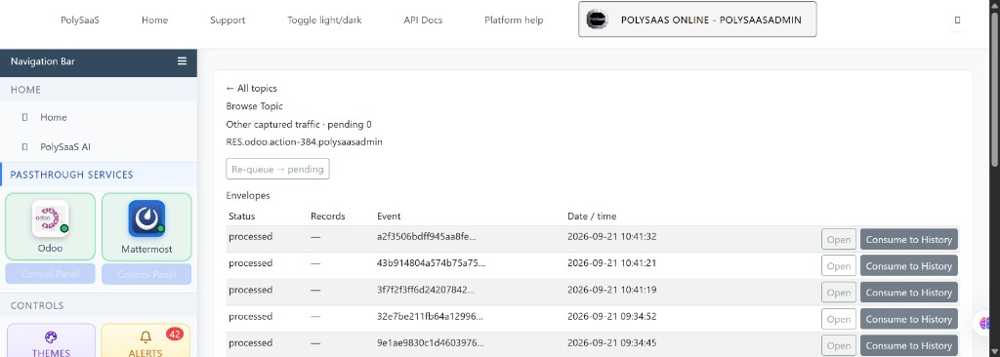
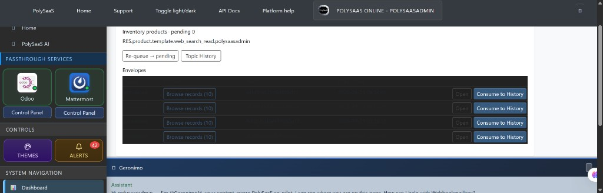

# BINGO: Captured Topics — Consume to History

**Date:** 2026-09-21  
**Status:** VERIFIED WORKING  
**Commit:** (this freeze commit) · feature tip `20924e98`  
**Branch:** main

## What Was Verified

1. **Captured Topics** admin section appears after Authentication and Authorization (`captured_topics` proxy app; Docker image copies the app).
2. Hub lists typed topics; **Browse Topic** shows mailbox envelopes with **Date / time**, **Open**, and **Consume to History**.
3. **Consume to History** writes typed history rows and **removes the envelope from the topic queue** (mailbox row deleted after drain).
4. **Topic History** shows permanent rows after consume.
5. Light/dark contrast fixed for Bootswatch themes (`darkly` / `cyborg` / `slate` / `solar` / `superhero`).

## Architecture

```
Webhook → WebhookMailbox (topic = typed temporary queue)
              ↓ Consume to History
         history_* tables (tenant schema)
              ↓ mailbox envelope deleted from queue
```

Families: Inventory products · SNMP telemetry · Maintenance equipment.

## Screenshot proof

### Browse Topic — Date/time, Open, Consume to History (light)



### Dark mode — contrast bug that was fixed (before)



## Frozen source files

- `dose/services/topic_consume.py`
- `dose/models/topic_history.py`
- `dose/templates/admin/dose/topic_browser.html`
- `dose/templates/admin/dose/topic_detail.html`
- `dose/templates/admin/dose/topic_history.html`
- `dose/admin.py` (topic hub views; already frozen — BINGO line added)
- `captured_topics/admin.py`
- `captured_topics/apps.py`
- `captured_topics/models.py`

## Next session

- **Type 2 SNMP** video / demo (week feeds → topic → Consume → history → optional Odoo maintenance).
