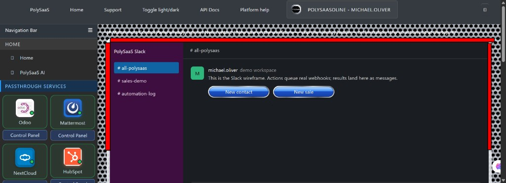
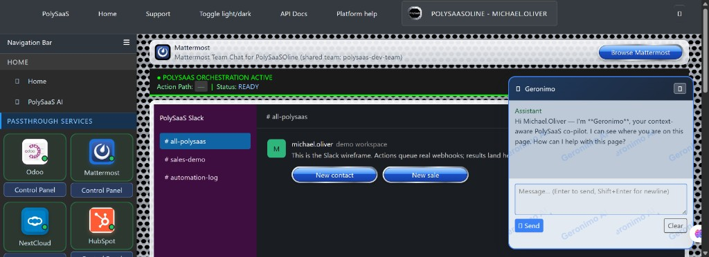

<!-- THIS CODE IS FROZEN — NO CHANGES TO THIS CODE ARE ALLOWED WITHOUT THE OWNER'S PERMISSION -->
<!-- BINGO: Founders Beta $10 + Mattermost CP — 2026-09-16 -->
# BINGO: Founders Beta $10 + Mattermost Control Panel (no wireframe)

**Date:** 2026-09-16  
**Branch:** `main`  
**Commit:** _(filled after commit)_  

## What was verified

### Founders Beta (subscribe)

- Plan tier `founders-beta` at **$10/mo for 6 months**, then normal rates.
- Selecting Founders Beta **locks** other plans, seats, promo, and app checkboxes; fee stays fixed at $10.
- Backend forces Odoo + MatterMost + `enable_external_saas_3` entitlement; rejects promo codes on this tier.
- Stripe live catalog Price ID wired via `STRIPE_PRICE_ID_FOUNDERS_BETA` (env — not committed plaintext).
- Hostinger compose passes Founders / live Stripe env vars.

### Mattermost Control Panel

- Removed Slack wireframe mock (purple sidebar + in-channel New contact / New sale) from Mattermost endpoint home.
- Restored standard endpoint identity header + orchestration bar.
- **New contact** / **New sale** remain as bookmark popup actions (same pattern as Slack).
- `MattermostEndpointActionAdapter` registered; `surface_template = ""`.

## Screenshot proof

### Mattermost — wireframe panel that was removed (annotated)

*Figure 1 — Purple “PolySaaS Slack” wireframe on Mattermost Control Panel (owner annotation: remove this panel).*

### Mattermost — prior Control Panel chrome (context)

*Figure 2 — Mattermost Control Panel with header / orchestration / wireframe before the no-wireframe fix.*

## Files in this BINGO (freeze)

| Area | Paths |
|------|--------|
| Founders / Stripe | `mysite/settings.py`, `dose/services/subscription_pricing.py`, `dose/subscription_views.py`, `dose/models/subscription.py`, `dose/views/main.py`, `dose/views/founder_views.py`, `dose/services/founder_provisioner.py`, `dose/templates/dose/subscribe.html`, `dose/templates/dose/founders_beta_circle.html`, `dose/templates/founder_form_wordpress.html`, `documentation/website/founders-beta-offer-block.html`, `deploy/hostinger/docker-compose.yml`, `deploy/hostinger/.env.example` |
| Mattermost CP | `dose/endpoint_actions/mattermost.py`, `dose/endpoint_actions/registry.py`, `dose/templates/dose/endpoint_home.html`, `dose/static/admin/css/endpoint_home.css`, `dose/polysniffer/views/mattermost_static_proxy.py`, `dose/views/mattermost_events_webhook.py` |
| Docs / assets | this file, `documentation/assets/BINGO_founders_mm_cp_2026-09-16_*.jpg`, pitch deck line update |

## Secrets note

Live Stripe keys (`sk_live_`, `pk_live_`, `whsec_`, price IDs) live in **gitignored** `.env` / `deploy/hostinger/.env` and Dokploy. Do not commit plaintext keys. Re-encrypt `.env.enc` via `Protect-PolySaaSEnv` on the office machine before laptop sync if `.env` changed.

## Freeze

Every source file above carries:

`THIS CODE IS FROZEN — NO CHANGES TO THIS CODE ARE ALLOWED WITHOUT THE OWNER'S PERMISSION`

`BINGO: Founders Beta $10 + Mattermost CP — 2026-09-16`
