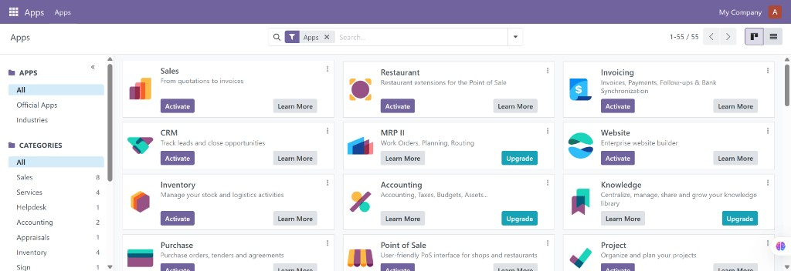

# BINGO: Hostinger / Dokploy — Odoo HTTPS login

**Date:** 2026-09-12  
**Status:** VERIFIED WORKING  
**Commit:** (filled after commit)  
**Branch:** main

## What Was Verified

1. Dokploy Compose deploy from `mikeoliveraz2/PolySaaS` (`deploy/hostinger/docker-compose.yml`) is up.
2. Public URL `https://odoo.prod-polysaas.cloud/web/login` serves Odoo 18 via Traefik → **odoo-edge** (nginx) → **odoo:8069**.
3. `web.base.url` set to `https://odoo.prod-polysaas.cloud`.
4. Login as `admin` succeeds (HTTP 303 → `/odoo` via curl cookie-jar and live browser).
5. Authenticated Apps UI loads (Kanban of modules under **My Company**).

## Architecture (certified)

| Layer | Role |
|-------|------|
| Dokploy Traefik | TLS for `odoo.prod-polysaas.cloud` |
| `odoo-edge` (nginx) | Forwards to Odoo with Host / X-Forwarded-* |
| `odoo` | `proxy_mode = True` via `odoo.proxy.conf` + `--proxy-mode` |
| `odoo-db` | Postgres for Odoo |

## Screenshot proof

Logged-in Odoo **Apps** page on production Hostinger stack (2026-09-12):

## Frozen files (this BINGO)

- `deploy/hostinger/docker-compose.yml` (Odoo + odoo-edge services / Traefik labels)
- `deploy/hostinger/odoo-nginx.conf`
- `deploy/hostinger/odoo.proxy.conf`

## Notes

- Odoo 18 does **not** set the `Secure` flag on `session_id` even with correct forwarded HTTPS headers; CSRF still works when the session cookie is preserved across GET→POST.
- Rotate the temporary Odoo admin password used during bootstrap.
- PolySaaS Django core on the same stack was brought up earlier this session (migrate + tenant); Mattermost public routing is **not** part of this BINGO.

## Next (not frozen by this BINGO)

1. Wire PolySaaS passthrough to `http://odoo:8069` on Hostinger.
2. Mattermost Traefik / health on `mm.prod-polysaas.cloud`.
3. Password rotation + secret hygiene in Dokploy env.
