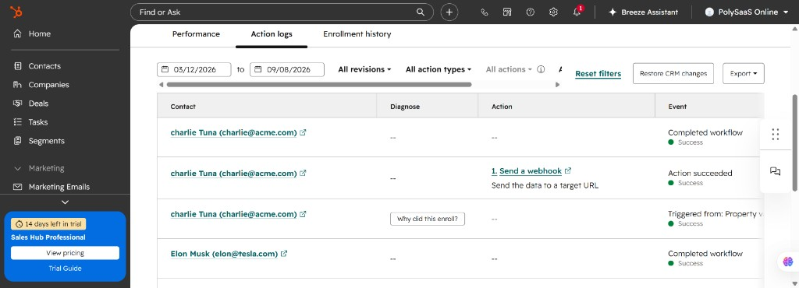
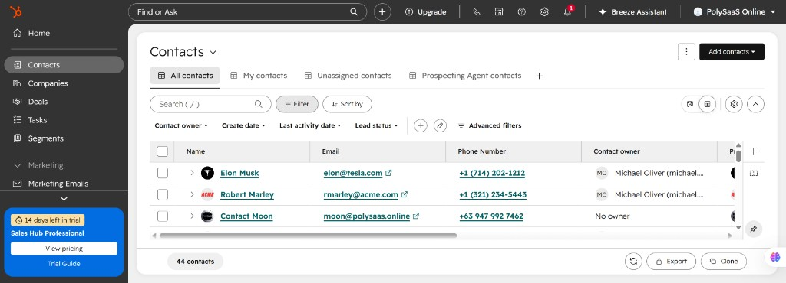
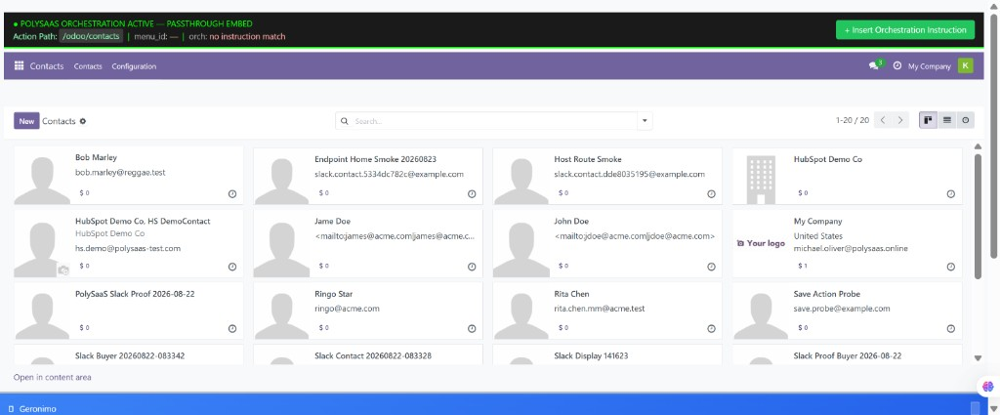

# BINGO: HubSpot → Odoo Contact Creation (same mailbox as Slack/Mattermost)

**Date:** 2026-09-08  
**Status:** VERIFIED WORKING  
**Commit:** 11a0d627  
**Branch:** main

## What Was Verified

1. HubSpot contact create enrolls workflow **Send POST request when Create Date property val** (On).
2. FlowLink **Send a webhook** POSTs to  
   `https://<ngrok>/dose/webhook/hubspot/polysaasonline/`
3. `HubSpotToOdooContactSync` extracts properties and calls `publish_slack_contact_event()`.
4. Mailbox consumer runs existing `OdooCreatePartner` on `slack.message.contact`.
5. **Live proof:** contact **charlie Tuna** (`charlie@acme.com`) created in Odoo from HubSpot.

Unified chat format (Slack + Mattermost, same session):

```
newpolysaascontact Name, email, Company
```

HubSpot does **not** use that chat trigger — it sends CRM properties via webhook body.

## Screenshot proof

### HubSpot Action logs — webhook succeeded (charlie Tuna / Elon Musk)



### HubSpot Contacts — source records



### Odoo Contacts — earlier HubSpot-path partners visible in passthrough (Ringo Star, HS DemoContact); charlie Tuna confirmed in UI by Michael 2026-09-08



## Architecture

```
HubSpot (Contact created / Create date known)
    ↓ FlowLink Send a webhook (POST + JSON body with properties)
POST /dose/webhook/hubspot/<tenant_slug>/
    ↓ generic_inbound_webhook → HubSpotToOdooContactSync
publish_slack_contact_event()
    ↓ topic: slack.message.contact
OdooCreatePartner (unchanged)
```

## Body that works (FlowLink)

Tokens must be **expanded** (use property picker / `{{contact.firstname}}` style — not literal `{{firstname}}` left unexpanded):

```json
{
  "properties": {
    "firstname": "{{contact.firstname}}",
    "lastname": "{{contact.lastname}}",
    "email": "{{contact.email}}",
    "company": "{{contact.company}}"
  }
}
```

Empty body → 200 skipped. Unexpanded `{{...}}` strings → skipped after cleanup guard.

## Files (this bingo)

| File | Role |
|------|------|
| `dose/contact_message_format.py` | Shared `newpolysaascontact` parser |
| `dose/views/slack_events_webhook.py` | Uses shared parser |
| `dose/views/mattermost_events_webhook.py` | Uses shared parser |
| `dose/services/hubspot_to_odoo_contact_sync.py` | HubSpot → mailbox (not direct XML-RPC) |
| `dose/tests/test_hubspot_contact_mailbox.py` | Unit tests |
| `scripts/update_mm_webhook.py` | Live MM trigger `newpolysaascontact` |
| `.cursor/rules/bingo-freeze.mdc` | Restored required screenshot-proof step |

## Tenant / ops

- Tenant slug: `polysaasonline`
- Seed: `python manage.py seed_hubspot_odoo_orchestration polysaasonline`
- Webhook URL: `/dose/webhook/hubspot/polysaasonline/`
- Mailbox consumer must be running (`runall.ps1`)

## Learnings

1. HubSpot “Success” only means HTTP 200 — empty body still succeeds.
2. FlowLink must interpolate contact properties; hand-typed `{{firstname}}` may stay literal.
3. Screenshot proof is required on every BINGO doc going forward (`bingo-freeze.mdc`).
