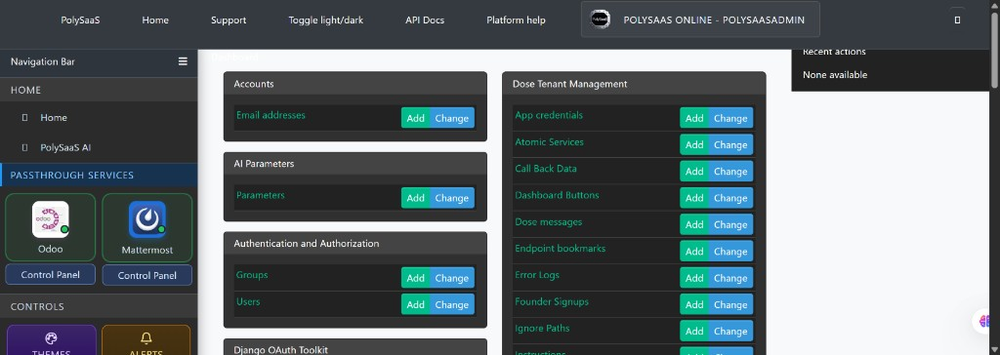
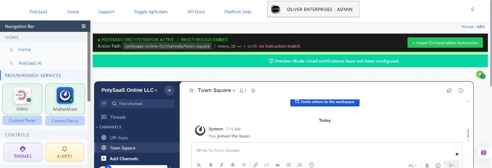

<!-- THIS CODE IS FROZEN — NO CHANGES TO THIS CODE ARE ALLOWED WITHOUT THE OWNER'S PERMISSION -->
<!-- BINGO: Mattermost Browse search_path / tenant schema — 2026-09-19 -->

# BINGO: Mattermost Browse — tenant schema search_path (Founders)

**Status: FROZEN.** Do not edit certified files without Michael / Shela permission.  
**Date:** 2026-09-19 (Saturday)  
**Branch:** `main`  
**Fix commit (behavior):** `a0bc2367`  
**Rule reinforcement (related):** `feb5a3d2`  
**This BINGO / freeze commit:** `927ea37c`

## What was verified

Owner (Michael) certified on Hostinger Founders tenant **PolySaaS Online** (`schema=polysaas`, user `polysaasadmin`):

1. Mattermost tile green + Control Panel in Jazzmin sidebar.
2. Mattermost **logo / Browse** no longer returns  
   `Passthrough endpoint not found — No enabled PassThroughEndpoint with slug mattermost`.
3. Public Mattermost healthy: `https://mm.prod-polysaas.cloud/api/v4/system/ping` → `status: OK`.

## Root cause (certified)

`PassthroughAuthMiddleware._inject_app_token` ran on `/pt/admin/mattermost/` and executed:

```python
SET search_path TO public,pg_catalog
```

…and **left** the connection there. `ExternalPassthroughMiddleware` then resolved `PassThroughEndpoint` in **`public`**, where tenant-owned rows must never live. The real row was (correctly) in schema **`polysaas`**.

That pattern violates owner architecture: **no tenant-owned data in `public`**; isolation is **schema-per-tenant**, not `tenant_id` in shared tables.

## Fix (frozen)

`dose/middleware/passthrough_auth.py`:

- Query `TenantApp` in the **tenant** schema (`request.schema_name`).
- Keep `search_path` as `"<tenant>", public` — never clobber to `public`-only before passthrough lookup.

## Screenshot proof



Caption: Founders admin (`POLYSAAS ONLINE - POLYSAASADMIN`) — Mattermost tile + Control Panel ready (2026-09-19). Browse 404 was observed on logo click before the search_path fix; owner verified Browse after Dokploy django Rebuild with `a0bc2367`.



Caption: Reference — Hostinger MM passthrough Town Square UI (from 2026-09-13 Hostinger MM BINGO).

## FROZEN FILES — NO EDITS WITHOUT OWNER PERMISSION

| File | Role |
|------|------|
| `dose/middleware/passthrough_auth.py` | Certified fix — search_path / TenantApp tenant-schema lookup |
| `dose/middleware/passthrough_auth.py.bak` | Pre-edit backup of frozen file |
| `documentation/BINGO_MM_BROWSE_SEARCHPATH_TENANT_SCHEMA_2026-09-19.md` | This certification |
| `documentation/assets/BINGO_MM_BROWSE_SEARCHPATH_2026-09-19_*.jpg` | Screenshot proof |

Related (already frozen elsewhere; do not “improve”): Mattermost handler / passthrough core per prior Mattermost BINGOs.

## Ops

- Django is image-baked — Dokploy **Rebuild** django after push (Deploy alone may not pick up code).
- Tenant schema for this Founders account: **`polysaas`** (not `polysaasonline`).
- GOLD ZIP: `D:\BINGO ZIPS\BINGO_MM_BROWSE_SEARCHPATH_2026-09-19.zip`

## Explicit freeze reminder for agents

```
THIS CODE IS FROZEN — NO CHANGES TO THIS CODE ARE ALLOWED WITHOUT THE OWNER'S PERMISSION
```

If Browse / Mattermost auth middleware “needs a fix,” **stop and ask**. Do not reintroduce `SET search_path TO public` before tenant-owned queries.
