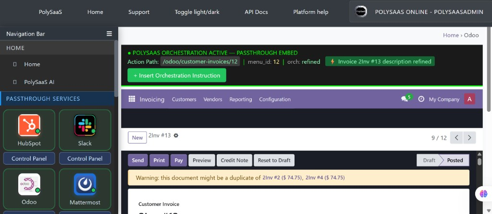
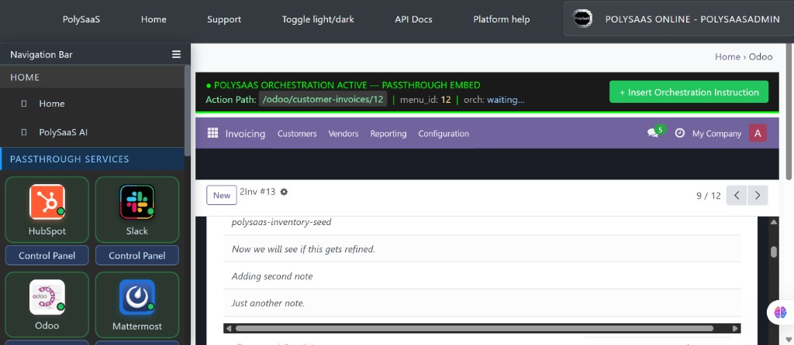

<!-- THIS CODE IS FROZEN — NO CHANGES TO THIS CODE ARE ALLOWED WITHOUT THE OWNER'S PERMISSION -->
<!-- BINGO: Odoo invoice Note refine — 2026-09-23 -->

# BINGO: Odoo invoice Note refine

**Date:** 2026-09-23  
**Status:** VERIFIED WORKING  
**Commit:** pending stamp  
**Branch:** main  
**Where:** polysaas.online passthrough, tenant PolySaaS Online, customer invoice **2Inv #13** (Posted)

## What was verified

Confirm on a draft invoice posts it in Odoo, then `RefineOdooInvoiceDescription` cleans the Note and the "Add a note" lines. Amounts stay put. The green bar reports the result.

On **2Inv #13** the line notes changed as follows:

| Before | After |
| --- | --- |
| now we seee if this gets refucking fined | Now we will see if this gets refined. |
| adding scond damn note | Adding second note |
| Just another note. | Just another note. (already clean) |

The product line `polysaas-inventory-seed` was not rewritten.

## Screenshot proof

### Green bar — `orch: refined` and the DoseMessage

### Invoice lines after refine

## Frozen source files

- `dose/services/refine_odoo_invoice_description.py`
- `dose/messaging.py`
- `dose/tests/test_refine_odoo_invoice_description.py`
- `dose/templates/admin/passthrough_embed.html` (already frozen — BINGO line added)

`documentation/ACTIVE_HANDOFF.md` stays the living handoff and is not frozen.
