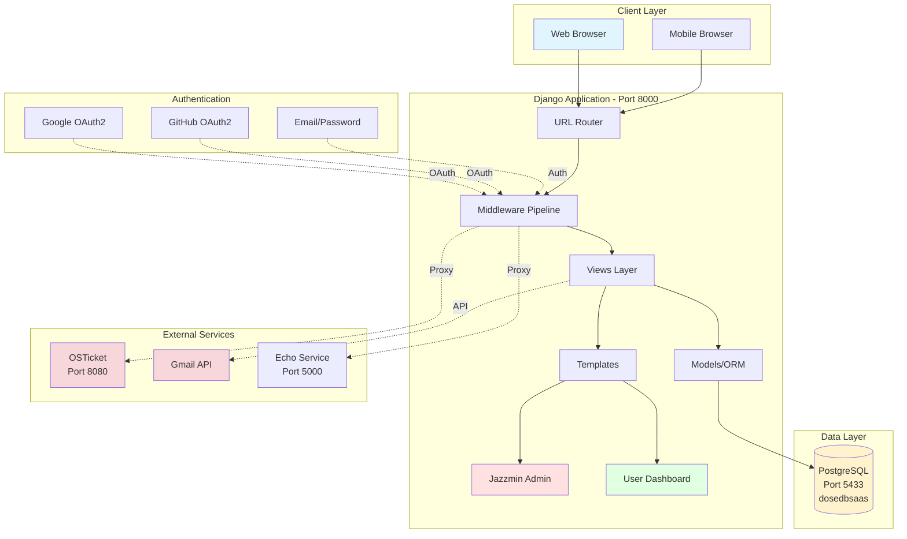
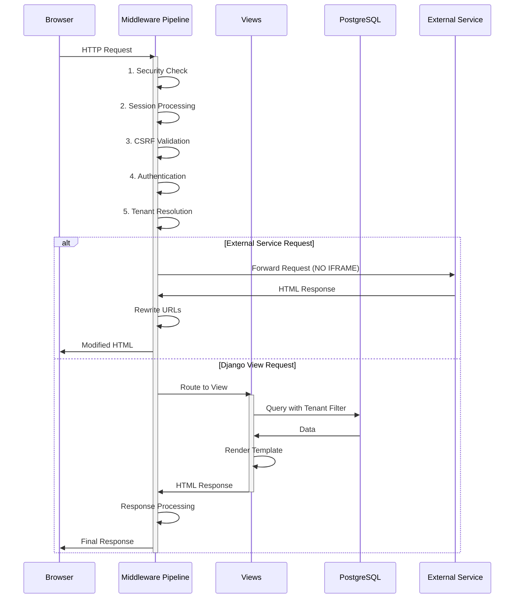
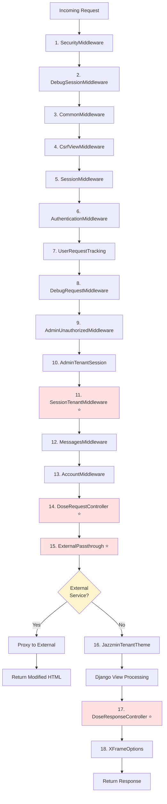
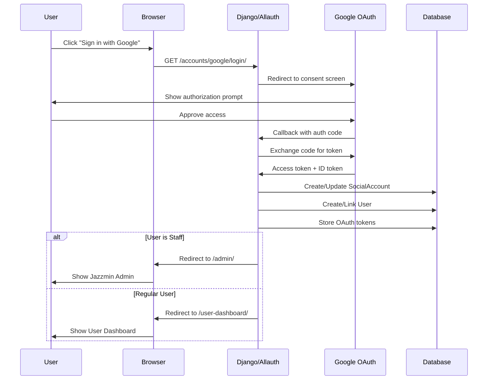
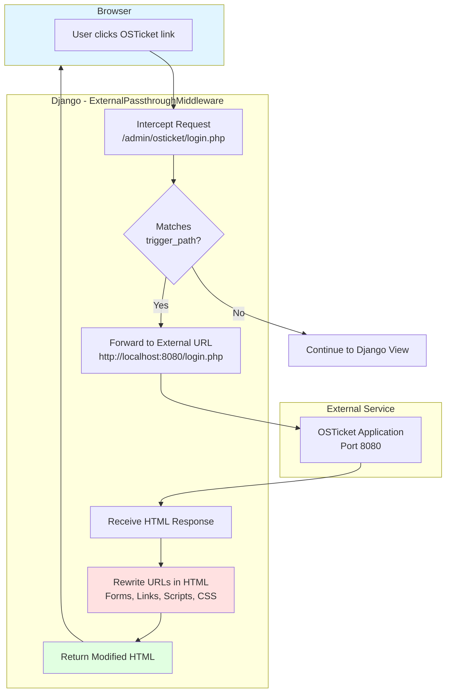
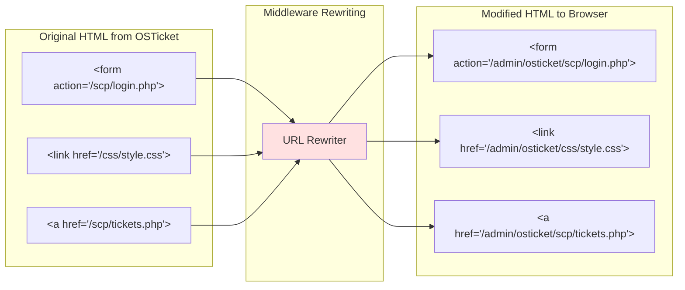
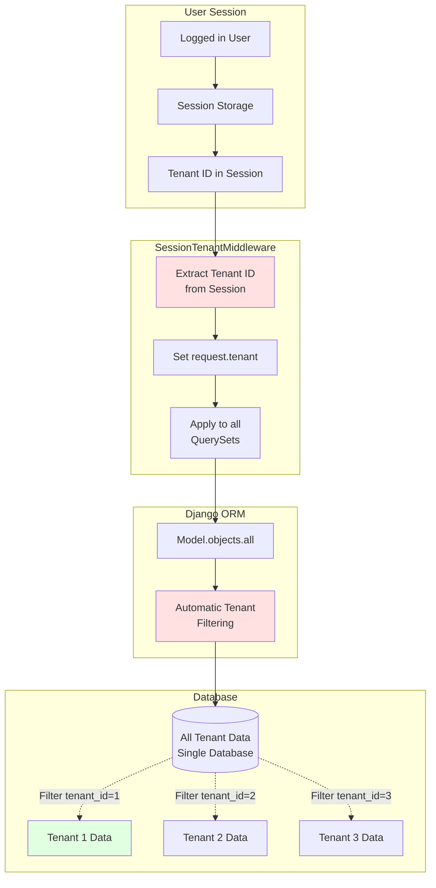
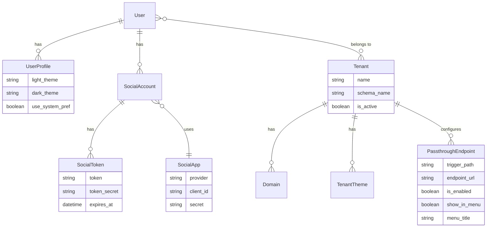
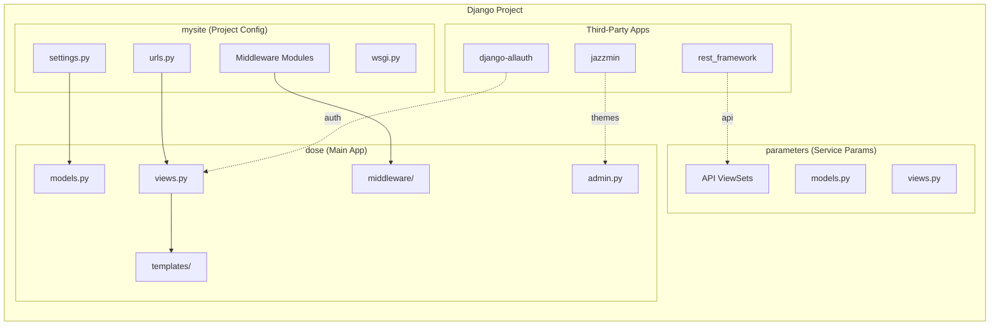
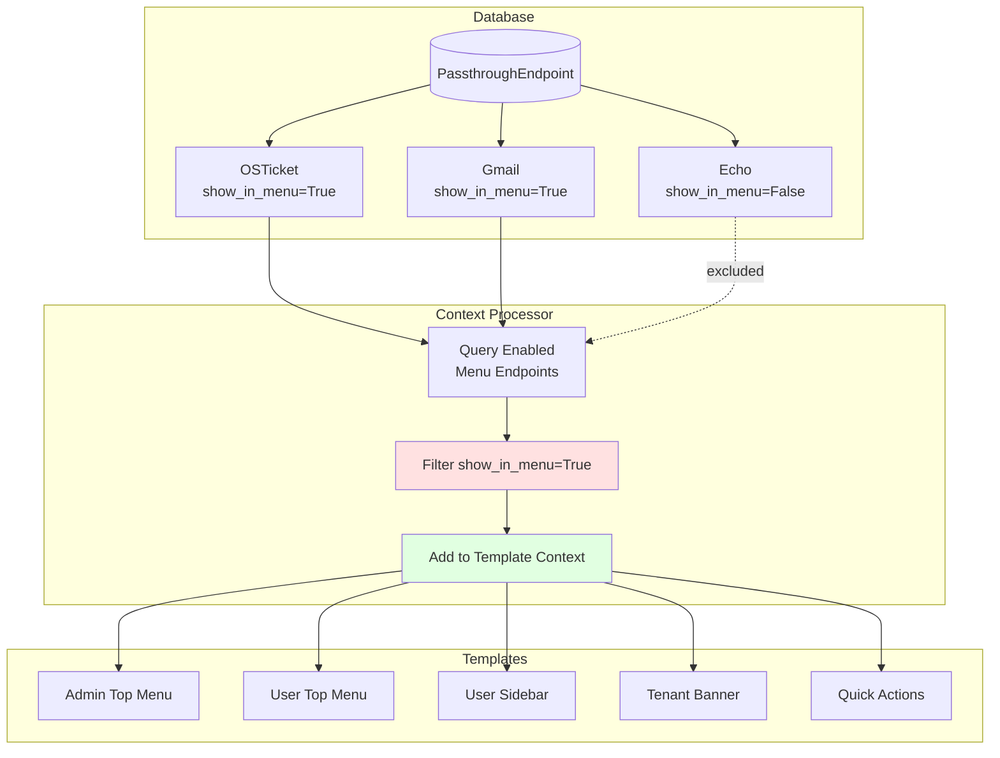

# DOSE Architecture - Visual Diagrams

This document contains visual flowcharts and diagrams for the DOSE multi-tenant SaaS platform.

## Table of Contents
1. [High-Level System Architecture](#high-level-system-architecture)
2. [Request Flow](#request-flow)
3. [Middleware Pipeline](#middleware-pipeline)
4. [OAuth Authentication Flow](#oauth-authentication-flow)
5. [External Service Passthrough](#external-service-passthrough)
6. [Multi-Tenant Architecture](#multi-tenant-architecture)
7. [Database Schema Overview](#database-schema-overview)

---

## High-Level System Architecture



---

## Request Flow



---

## Middleware Pipeline



---

## OAuth Authentication Flow



---

## External Service Passthrough (NO IFRAME)



### URL Rewriting Example



---

## Multi-Tenant Architecture



---

## Database Schema Overview



---

## Application Layer Structure



---

## Smart Login Redirect Logic

```mermaid
flowchart TD
    Start[User Accesses /] --> CheckAuth{User<br/>Authenticated?}
    CheckAuth -->|No| Login[Redirect to<br/>/accounts/login/]
    CheckAuth -->|Yes| CheckStaff{is_staff or<br/>is_superuser?}
    
    Login --> LoginPage[Login Page<br/>3 Options]
    LoginPage --> Google[Google OAuth]
    LoginPage --> GitHub[GitHub OAuth]
    LoginPage --> Email[Email/Password]
    
    Google --> OAuth[OAuth Flow]
    GitHub --> OAuth
    Email --> DjangoAuth[Django Auth]
    
    OAuth --> Success{Success?}
    DjangoAuth --> Success
    
    Success -->|Yes| CheckStaff
    Success -->|No| Login
    
    CheckStaff -->|Yes| AdminDash[/admin/<br/>Jazzmin Interface]
    CheckStaff -->|No| UserDash[/user-dashboard/<br/>AdminLTE Interface]
    
    AdminDash --> Features1[• Tenant Management<br/>• OSTicket Link<br/>• Gmail Link<br/>• Full Admin Tools]
    UserDash --> Features2[• Personal Dashboard<br/>• Service Links<br/>• Profile<br/>• Notifications]
    
    style CheckStaff fill:#fff3cd
    style AdminDash fill:#ffe1e1
    style UserDash fill:#e1ffe1
```

---

## Dynamic Menu Injection



---

## View this in GitHub

These diagrams use Mermaid syntax, which renders automatically on:
- GitHub
- GitLab
- VS Code (with Mermaid extension)
- Many markdown viewers

For the best experience, view this file on GitHub or use a Mermaid-compatible viewer.

## Legend

- 🔴 Red/Pink = Critical Components
- 🟢 Green = User-Facing
- 🟡 Yellow = Decision Points
- ⭐ = Key Features
- Solid lines = Direct flow
- Dotted lines = Async/OAuth/External

