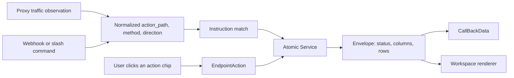

# PolySaaS Endpoint Workspace Model

Status: current (2026-09-01). Supersedes any description of endpoint homes as
"proxy endpoints vs API endpoints with different UIs".

Related and still authoritative: `POLYSAAS_UI_NAVIGATION_AND_EVENTS.md`,
`POLYSAAS_ORCHESTRATION_MODEL.md`, `.cursor/rules/passthrough-no-iframes.mdc`.

---

## One model, three trigger sources

There is no proxy model and API model. There is **one** model. Proxy traffic,
inbound webhooks, and user clicks are three ways to start the *same* pipeline.



The proxy does exactly two jobs: **Browse**, and **passively observing traffic
to fire triggers**. It is not a second orchestration engine, and per
`POLYSAAS_ORCHESTRATION_MODEL.md` you must not invent one.

---

## The four contracts

### 1. Endpoint Profile (declarative)

`EndpointActionAdapter.profile()` describes the whole workspace, so the view and
template never branch on app identity:

```python
{
  "browse_mode": "external",       # or "passthrough"
  "surface_template": "...",
  "actions":  [{"key", "kind", "title"}],
  "panels":   [{"key", "title", "object_type", "action"}],
  "bookmarks": [...],
}
```

`panels` derive from `direct_event` bookmarks. `popup_form` bookmarks are
actions, not panels.

**Rule: a new endpoint ships a profile, not bespoke UI.** If you find yourself
adding `if app == "x"` to `dose/views/endpoint_home.py` or a vendor name to the
template, add it to the adapter instead. The view now builds `action_urls` from
`profile["actions"]`, so no vendor action key appears in shared code.

### 2. Data envelope

One shape for every panel, built in `dose/endpoint_data/envelope.py`:

```python
{"status": "success", "title": "Invoices", "object_type": "invoice",
 "count": 12,
 "columns": [{"key": "name", "label": "Invoice", "format": "text"},
             {"key": "amount_total", "label": "Total", "format": "money",
              "numeric": True}],
 "rows": [...], "empty_message": "...", "detail": "...", "error": None}
```

`rows` is always a list and `count` always an int, including the empty and
error cases, so a consumer never branches on which happened. `validate_envelope()`
returns a list of contract violations.

Column options: `format` (`text|money|number|date`), `blank` (placeholder for an
empty value), `fallback` (`{key, prefix}`, e.g. show `#41` when `name` is empty),
`note_key` (sub-line under the cell), `numeric` (right-aligns).

For open-ended object types such as the HubSpot portlets, `columns_from_rows()`
derives columns from the first row.

**Deprecated for one release:** the per-vendor rows keys (`invoices`,
`contacts`, `sales`), `list_kind`, and the old private publisher names. New code
reads `envelope`.

### 3. Action contract

Two kinds only:

- `direct_event` — synchronous. Runs an Atomic Service, saves `CallBackData`,
  returns the envelope now. Declared as a `ListSpec` and executed by the single
  `publish_list()` in `dose/endpoint_actions/list_publisher.py`.
- `popup_form` — asynchronous via `WebhookMailbox`, returns a `mailbox_id` to poll.

There is no third kind.

### 4. Trigger contract

Proxy observation derives `action_path` from `upstream_path`; webhooks derive it
from a normalized logical key. Both converge on `(action_path, method,
direction)` Instruction matching. Unchanged by this work.

---

## Browse

Browse always opens a **top-level tab**. It never embeds vendor UI, and iframes
are not used (`.cursor/rules/passthrough-no-iframes.mdc`). Only the destination
differs, by app class:

| App class | `browse_mode` | Destination |
|---|---|---|
| Apps we already capture (Odoo, Mattermost, Nextcloud) | `passthrough` | `/pt/admin/…?ps_fullscreen=1` |
| Non-proxied SPAs (Slack, HubSpot) | `external` | real vendor URL |

`EndpointActionAdapter.browse_mode` defaults to **`external`**. Proxy Browse is
opt-in, because it only works where capture already exists. HubSpot is `external`
because its login needs a browser-only `csrf.app` cookie no proxy can supply
(`HUBSPOT_PASSTHROUGH_STATUS_2026-06-28.md`); Slack is `external` because its
client requires first-party `slack.com` cookies
(`architecture/POLYSNIFFER_NATIVE_FORWARDER.md`).

---

## The five regions, in priority order

Every endpoint home renders the same five regions in the same order. Data is the
body of the page; Wiring is not its peer.

1. **Identity** — logo, title, lede, Browse
2. **Orchestration bar** — action path and status
3. **Data** — panels from `profile.panels`, rendered from the envelope. This is
   the workspace and the demo surface.
4. **Actions** — a few chips. Producer/consumer/dynamic-service creation lives in
   a collapsed `Create…` overflow so it does not compete with Data.
5. **Wiring** — Producers and Consumers, in a `<details>` **collapsed by default**.

Two rules that are deliberate and should not be quietly undone:

- **Do not promote Producers/Consumers to a peer of Data.** That is what turned
  this page into a registry instead of a workspace.
- **Do not seed auto-provisioned producers at the top.** `User viewed Invoicing
  in Odoo` is a fine trigger but belongs under Wiring. The surface people should
  see is invoice, contact, and sale data.

---

## Rendering

`dose/static/admin/js/endpoint_table.js` is the single renderer. It is
column-driven, so adding an object type is a backend change only. Every value —
including header labels — goes through `esc()`. Both the endpoint home callback
panel and the HubSpot portlet page use it; the portlet page previously built
table HTML from raw API values and assigned it to `innerHTML`.

Never build table HTML inline again. Extend the envelope's columns instead.
