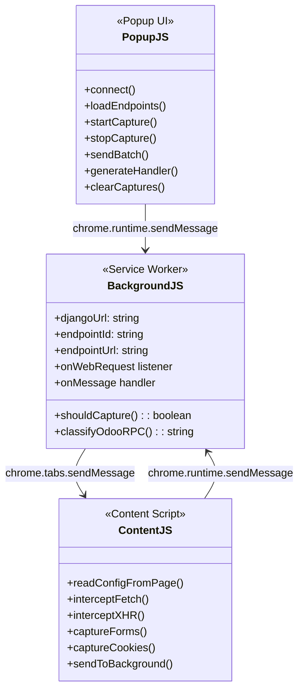

# PolySaaS Class Diagram

## Core Domain Models

```mermaid
classDiagram
    direction TB

    %% ──────────────────────────────────
    %% TENANT & AUTH
    %% ──────────────────────────────────

    class Tenant {
        +CharField name
        +SlugField slug
        +CharField schema_name [unique]
        +CharField primary_color
        +TextField description
        +CharField tagline
        +ImageField logo
        +BooleanField is_active
        +DateTimeField created_at
    }

    class TenantAwareModel {
        <<abstract>>
        +ForeignKey tenant → Tenant
    }

    class UserProfile {
        +OneToOneField user → auth.User
        +ForeignKey tenant → Tenant
        +BooleanField dark_mode
        +CharField theme
        +CharField last_selected_theme
        +CharField light_theme
        +CharField dark_theme
        +BooleanField use_system_pref
        +DateTimeField created_at
    }

    class Subscription {
        +OneToOneField tenant → Tenant
        +CharField stripe_customer_id
        +CharField stripe_subscription_id
        +CharField card_name
        +BooleanField active
        +DateTimeField created_at
        +DateTimeField updated_at
    }

    %% ──────────────────────────────────
    %% NAVIGATION & DASHBOARD
    %% ──────────────────────────────────

    class NavigationPanel {
        +CharField title
        +CharField panel_type
        +TextField description
        +BooleanField is_active
        +IntegerField sort_order
        +CharField panel_css_class
        +CharField panel_background_color
        +DateTimeField created_at
    }

    class NavigationItem {
        +ForeignKey panel → NavigationPanel
        +CharField title
        +CharField item_type
        +URLField url
        +TextField description
        +CharField icon_style
        +CharField icon_value
        +CharField target
        +BooleanField requires_authentication
        +CharField requires_permissions
        +BooleanField is_active
        +IntegerField sort_order
        +IntegerField click_count
        +DateTimeField last_clicked
    }

    class DashboardButton {
        +ForeignKey user → auth.User
        +CharField title
        +TextField description
        +URLField url
        +CharField button_type
        +CharField icon_style
        +CharField icon_value
        +CharField target
        +CharField color
        +CharField size
        +BooleanField is_active
        +IntegerField sort_order
        +IntegerField click_count
    }

    %% ──────────────────────────────────
    %% ORCHESTRATION
    %% ──────────────────────────────────

    class Instruction {
        +CharField eventKey
        +CharField requestpath
        +CharField requestmethod
        +CharField direction
        +TextField urllist
        +CharField appusername
        +TextField executescript
        +TextField description
        +JSONField parameters_json
        +BooleanField save_callbackdata
        +DateTimeField pub_date
    }

    class Task {
        +CharField title
        +CharField matchingEventKey
        +TextField description
        +JSONField parameters_json
        +BooleanField completed
        +DateTimeField created_at
        +DateTimeField completed_at
    }

    class CallBackData {
        +CharField matchingEventKey
        +TextField description
        +JSONField parameters_json
        +JSONField callbackdata
        +DateTimeField pub_date
    }

    %% ──────────────────────────────────
    %% ML & AI
    %% ──────────────────────────────────

    class MLEngine {
        +CharField engineName
        +URLField engineEndPoint
        +CharField matchingEventKey
        +TextField description
        +JSONField parameters_json
        +DateTimeField pub_date
    }

    class MLTaxonomy {
        +CharField matchingEventKey
        +TextField description
        +JSONField content_json
        +DateTimeField pub_date
    }

    class MLDataset {
        +CharField matchingEventKey
        +BooleanField isTraining
        +TextField description
        +JSONField content_json
        +DateTimeField pub_date
    }

    class DeepSeekPrompt {
        +ForeignKey user → auth.User
        +TextField prompt
        +TextField response
        +DateTimeField created_at
        +DateTimeField updated_at
    }

    %% ──────────────────────────────────
    %% PASSTHROUGH & INTEGRATION
    %% ──────────────────────────────────

    class PassThroughEndpoint {
        +BooleanField is_enabled
        +BooleanField bypass_middleware
        +CharField passthrough_type
        +CharField provider
        +URLField endpoint_url
        +TextField description
        +CharField trigger_path
        +JSONField discovered_subpaths
        +BooleanField show_in_menu
        +CharField menu_title
        +CharField menu_icon
        +IntegerField menu_sort_order
        +CharField integration_mode
        +URLField api_endpoint
        +CharField api_auth_type
        +CharField api_key
        +CharField api_key_header
        +CharField auth_username
        +CharField auth_password
        +BooleanField inject_proxy_script
        +DateTimeField created_at
    }

    class AtomicService {
        +CharField service_name
        +FileField python_file
        +TextField description
        +JSONField config_json
        +DateTimeField created_at
        +DateTimeField updated_at
    }

    class IgnorePath {
        +URLField url
        +TextField description
        +JSONField parameters
        +BooleanField is_active
        +DateTimeField created_at
    }

    %% ──────────────────────────────────
    %% MESSAGE QUEUE
    %% ──────────────────────────────────

    class MQConfig {
        +CharField name
        +CharField provider
        +BooleanField is_active
        +CharField rabbitmq_host
        +IntegerField rabbitmq_port
        +CharField rabbitmq_vhost
        +CharField rabbitmq_username
        +CharField rabbitmq_password
        +CharField pubsub_project_id
        +CharField pubsub_subscription
        +CharField pubsub_topic
        +TextField pubsub_credentials_json
        +BooleanField response_queue_enabled
        +CharField response_queue_name
        +TextField description
    }

    class MQInput {
        +CharField name
        +CharField provider
        +BooleanField is_active
        +CharField request_path
        +CharField request_method
        +CharField message_format
        +TextField message_schema
        +BooleanField auto_ack
        +IntegerField prefetch_count
        +CharField error_queue
        +IntegerField max_retries
        +IntegerField message_count
        +IntegerField error_count
    }

    class MQOutput {
        +CharField name
        +CharField provider
        +BooleanField is_active
        +CharField instruction_path
        +CharField message_format
        +TextField message_template
        +BooleanField include_request_metadata
        +BooleanField include_response_data
        +BooleanField persistent
        +IntegerField priority
        +CharField error_queue
        +IntegerField max_retries
        +IntegerField message_count
        +IntegerField error_count
    }

    %% ──────────────────────────────────
    %% LOGGING & TRACKING
    %% ──────────────────────────────────

    class RequestLog {
        +ForeignKey user → auth.User
        +CharField path
        +CharField method
        +DateTimeField timestamp
        +JSONField body
    }

    class ErrorLog {
        +ForeignKey user → auth.User
        +TextField error_message
        +CharField path
        +IntegerField status_code
        +DateTimeField timestamp
    }

    class UserRequestTracker {
        +ForeignKey user → auth.User
        +ForeignKey tenant → Tenant
        +CharField path
        +CharField method
        +DateTimeField timestamp
        +CharField user_agent
        +GenericIPAddressField ip_address
    }

    class DoseMessage {
        +ForeignKey user → auth.User
        +TextField message
        +CharField level
        +DateTimeField created_at
        +BooleanField is_read
    }

    %% ──────────────────────────────────
    %% POLYSNIFFER
    %% ──────────────────────────────────

    class TrafficLog {
        +CharField method
        +URLField url
        +CharField path
        +JSONField headers
        +JSONField cookies
        +JSONField query_params
        +TextField body
        +IntegerField status_code
        +TextField response_headers
        +TextField response_body
        +IntegerField response_size
        +CharField endpoint_name
        +ForeignKey user → auth.User
        +DateTimeField captured_at
        +FloatField duration_ms
        +JSONField har_data
    }

    class PolySnifferRun {
        +DateTimeField run_timestamp
        +CharField status
        +IntegerField packets_captured
        +TextField notes
        +TextField raw_data_summary
    }

    %% ──────────────────────────────────
    %% PARAMETERS APP
    %% ──────────────────────────────────

    class Parameter {
        +CharField matchingKey
        +IntegerField sequence
        +JSONField param_kwargs_json
        +CharField param1..param10
        +TextField description
        +ForeignKey created_by → auth.User
        +DateTimeField created_at
    }

    %% ──────────────────────────────────
    %% RELATIONSHIPS
    %% ──────────────────────────────────

    TenantAwareModel <|-- NavigationPanel
    TenantAwareModel <|-- DashboardButton
    TenantAwareModel <|-- Instruction
    TenantAwareModel <|-- Task
    TenantAwareModel <|-- CallBackData
    TenantAwareModel <|-- MLEngine
    TenantAwareModel <|-- MLTaxonomy
    TenantAwareModel <|-- MLDataset
    TenantAwareModel <|-- RequestLog
    TenantAwareModel <|-- ErrorLog
    TenantAwareModel <|-- IgnorePath
    TenantAwareModel <|-- MQConfig
    TenantAwareModel <|-- MQInput
    TenantAwareModel <|-- MQOutput
    TenantAwareModel <|-- PolySnifferRun
    TenantAwareModel <|-- Subscription

    TenantAwareModel --> Tenant : tenant FK

    UserProfile --> Tenant : tenant FK
    UserRequestTracker --> Tenant : tenant FK

    NavigationItem --> NavigationPanel : panel FK

    Subscription --> Tenant : tenant OneToOne
    UserProfile "1" --> "1" Tenant : belongs to

    DeepSeekPrompt --> User : user FK
    DoseMessage --> User : user FK
    DashboardButton --> User : user FK
    RequestLog --> User : user FK
    ErrorLog --> User : user FK
    TrafficLog --> User : user FK
    UserRequestTracker --> User : user FK
    Parameter --> User : created_by FK

    class User {
        <<Django auth.User>>
        +CharField username
        +CharField email
        +CharField password
        +BooleanField is_staff
        +BooleanField is_active
    }
```

---

## Middleware Classes

```mermaid
classDiagram
    direction LR

    class DebugSessionMiddleware {
        +get_response()
        +__call__()
        handles SessionInterrupted
        handles PermissionError
    }

    class CSRFExemptionMiddleware {
        +get_response()
        +__call__()
        exempts passthrough paths
    }

    class UserRequestTrackingMiddleware {
        +get_response()
        +__call__()
        logs to UserRequestTracker
    }

    class AdminUnauthorizedMiddleware {
        +get_response()
        +__call__()
        returns 403 for non-staff
    }

    class AdminTenantSessionMiddleware {
        +get_response()
        +__call__()
        sets tenant session keys
    }

    class SessionTenantMiddleware {
        +get_response()
        +__call__()
        SET search_path per tenant
    }

    class DoseRequestController {
        +get_response()
        +__call__()
        matches Instructions by eventKey
        publishes to MQ
    }

    class JazzminTenantThemeMiddleware {
        +get_response()
        +__call__()
        applies tenant theme/menu
    }

    class DoseResponseController {
        +get_response()
        +__call__()
        processes callbacks
        logs CallBackData
    }

    class ExternalPassthroughMiddleware {
        +get_response()
        +__call__()
        proxies /pt/ requests
    }

    DebugSessionMiddleware --> CSRFExemptionMiddleware : next
    CSRFExemptionMiddleware --> UserRequestTrackingMiddleware : next
    UserRequestTrackingMiddleware --> AdminUnauthorizedMiddleware : next
    AdminUnauthorizedMiddleware --> AdminTenantSessionMiddleware : next
    AdminTenantSessionMiddleware --> SessionTenantMiddleware : next
    SessionTenantMiddleware --> DoseRequestController : next
    DoseRequestController --> JazzminTenantThemeMiddleware : next
    JazzminTenantThemeMiddleware --> DoseResponseController : next
    DoseResponseController --> ExternalPassthroughMiddleware : next
```

---

## PolySniffer Chrome Extension Components

---

*Diagrams rendered with Mermaid. View in any Mermaid-compatible viewer or GitHub.*
