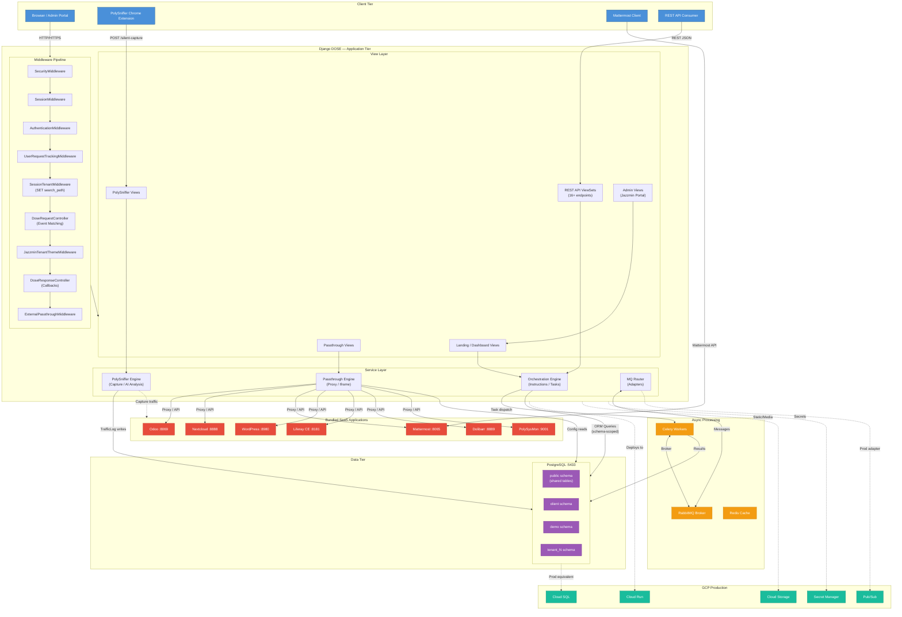
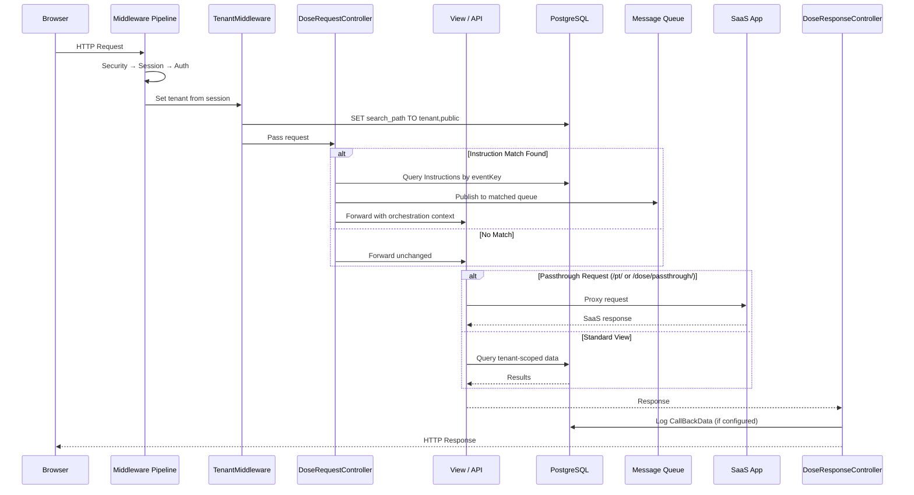
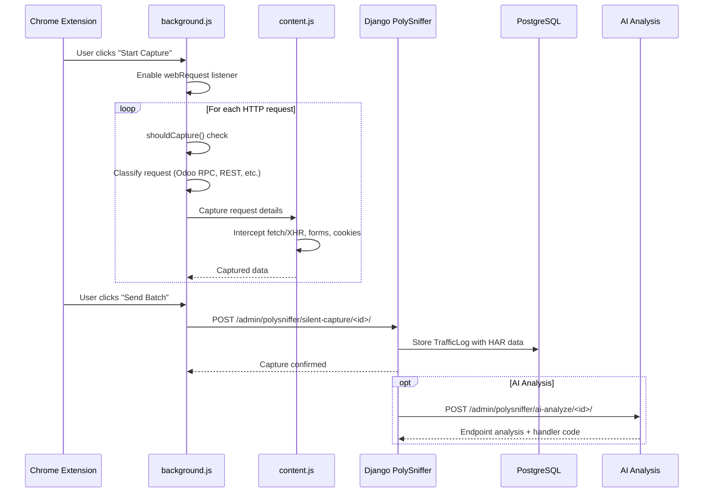
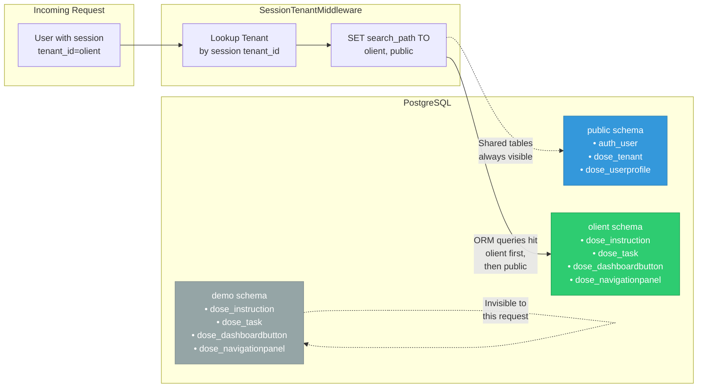

# PolySaaS Dataflow Diagram

## System-Wide Dataflow

---

## Request Lifecycle Dataflow

---

## PolySniffer Capture Flow

---

## Multi-Tenant Data Isolation

---

*Diagrams rendered with Mermaid. View in any Mermaid-compatible viewer or GitHub.*
