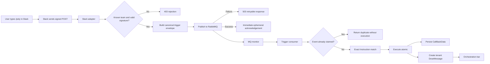

# Slack Webhook Orchestration Design

## Document Control

| Field | Value |
|---|---|
| Status | Approved and implemented for slice 1 |
| Date | 2026-08-15 |
| Scope | Slack `/poly` inbound trigger only |
| Implementation commit | `00ddd80a` |
| Canonical handoff | `documentation/ACTIVE_HANDOFF.md` |

## 1. Purpose

This document defines how a Slack `/poly` command enters the PolySaaS
Instruction and atomic-service engine without coupling atomic execution to the
inbound Slack HTTP request.

The design follows the locked orchestration model:

- Every orchestration begins with a user or system trigger.
- A webhook delivers a trigger that occurred in another system; it does not
  create a spontaneous trigger.
- Instructions continue to match only `(action_path, method, direction)`.
- Results are persisted for audit and surfaced through the orchestration bar.

## 2. Scope

### Included

- Slack `/poly` slash-command request verification.
- Tenant resolution from the stored Slack `team_id` mapping.
- Canonical trigger-envelope creation.
- RabbitMQ publication before the Slack acknowledgement.
- Asynchronous trigger consumption.
- Exact Instruction matching.
- Atomic-service execution.
- Per-tenant event deduplication.
- `CallBackData` audit persistence.
- Tenant-visible `DoseMessage` feedback.

### Excluded

- Slack browser, Native, or passthrough product flows.
- HubSpot or other provider adapters.
- Changes to the long-term generic webhook path.
- Instruction schema migrations.
- Delayed Slack `response_url` messages.
- A second orchestration engine.

## 3. System Context

| Component | Responsibility |
|---|---|
| Slack UI | Captures the user's `/poly` command and causes Slack to send the webhook. |
| Slack adapter | Resolves the tenant, verifies the request, creates the envelope, publishes it, and acknowledges Slack. |
| RabbitMQ | Decouples the Slack request lifetime from Instruction and atomic execution. |
| MQ monitor | Recognizes PolySaaS trigger envelopes and routes them to the trigger consumer. |
| Trigger consumer | Deduplicates the event and performs exact Instruction matching. |
| Instruction | Selects the atomic service for the canonical action triple. |
| Atomic service | Executes the requested business operation. |
| `CallBackData` | Stores the execution result for audit. |
| `DoseMessage` | Delivers success or failure feedback to tenant operators. |
| Orchestration bar | Displays the resulting operator feedback. |

## 4. Architecture



## 5. Canonical Instruction Identity

All Slack `/poly` Instructions use this exact triple:

```text
action_path = /events/slack/command/poly
method      = POST
direction   = REQ
```

The human-readable event key is:

```text
slack.command.poly
```

The consumer uses exact database equality for all three matching fields. It
does not use substring matching, provider-specific service lookup, or the
legacy `/mq/` path transformation.

## 6. Trigger Envelope

The versioned envelope kind is `polysaas.trigger.v1`.

```json
{
  "kind": "polysaas.trigger.v1",
  "event_id": "stable SHA-256 identifier",
  "correlation_id": "UUID",
  "tenant_schema": "tenant_one",
  "source": "slack",
  "action_path": "/events/slack/command/poly",
  "method": "POST",
  "direction": "REQ",
  "event_key": "slack.command.poly",
  "actor": {
    "external_user_id": "U123",
    "team_id": "T123"
  },
  "payload": {
    "command": "/poly",
    "text": "create customer Alice",
    "channel_id": "C123",
    "response_url": ""
  },
  "received_at": "2026-08-15T12:00:00+00:00"
}
```

### Field Rules

| Field | Rule |
|---|---|
| `kind` | Must equal `polysaas.trigger.v1`. |
| `event_id` | Stable hash of Slack workspace and command-trigger fields; deduplicated within the tenant. |
| `correlation_id` | New UUID for tracing one accepted delivery through execution and feedback. |
| `tenant_schema` | Derived from verified `team_id` mapping, never from caller-provided URL identity. |
| `source` | Fixed to `slack` for this adapter. |
| `action_path` | Fixed to `/events/slack/command/poly`. |
| `method` | Fixed to `POST`. |
| `direction` | Fixed to `REQ`. |
| `event_key` | Fixed to `slack.command.poly`. |
| `actor` | External Slack user and team identity. |
| `payload` | Command data required by the selected atomic; provider secrets are excluded. |
| `received_at` | UTC ISO-8601 receipt timestamp. |

## 7. Inbound Request Sequence

1. Slack sends `POST /hooks/slack/commands/`.
2. PolySaaS reads `team_id` from the signed form body.
3. PolySaaS searches active tenant schemas for a Slack `TenantApp` whose
   `extra_config.slack_team_id` matches exactly.
4. PolySaaS loads the signing secret from that same tenant-owned `TenantApp`.
5. PolySaaS validates `X-Slack-Signature` and rejects timestamps older than
   five minutes.
6. PolySaaS creates the canonical trigger envelope.
7. PolySaaS publishes the envelope to the tenant's active RabbitMQ config using
   routing key `polysaas.events.slack.command.poly`.
8. On successful publication, PolySaaS returns an ephemeral acknowledgement.
9. On publication failure, PolySaaS returns HTTP 503 so the trigger is not
   falsely acknowledged as queued.
10. No Instruction or atomic runs inside the Slack request.

## 8. Consumer Sequence

1. The existing MQ monitor receives a queue message.
2. If `kind` equals `polysaas.trigger.v1`, the monitor routes it to the trigger
   consumer; all other messages continue through the legacy MQ controller.
3. The consumer verifies that the envelope tenant matches the configured
   tenant.
4. The consumer atomically claims `(tenant_schema, event_id)` using a
   PostgreSQL transaction advisory lock and a tenant `RequestLog` record.
5. A duplicate delivery returns `duplicate` without running an Instruction.
6. The consumer selects Instructions using exact equality on the canonical
   action triple.
7. Each matched Instruction resolves its atomic through the existing atomic
   service registry.
8. The consumer records success or failure in `CallBackData` when enabled.
9. The consumer creates a `DoseMessage` for each tenant member so regular
   operators, not only superusers, can receive orchestration-bar feedback.

## 9. Security Controls

- Tenant identity is obtained only from the stored Slack `team_id` mapping.
- The URL does not provide or override tenant identity.
- Slack signatures use HMAC-SHA256 and constant-time comparison.
- Requests older than five minutes are rejected.
- Unknown teams, missing secrets, and bad signatures return HTTP 403.
- Tenant-owned Slack credentials remain in the tenant schema.
- Envelope tenant mismatch is rejected by the consumer.
- Provider secrets are not copied into the event payload.

## 10. Delivery and Deduplication

The event identity is unique within a tenant:

```text
(tenant_schema, event_id)
```

The consumer serializes claims for that identity with a PostgreSQL advisory
transaction lock. It writes a `RequestLog` claim before Instruction execution.
Subsequent Slack retries with the same event identity do not rerun atomics.

### Known Delivery Risk

The existing RabbitMQ adapter acknowledges a queue message during `consume()`,
before dispatcher execution. A worker crash after consumption but before the
atomic finishes can therefore lose that delivery. This behavior predates the
Slack slice and was intentionally not redesigned in slice 1. Production
hardening should move acknowledgement until after successful dispatch and use
negative acknowledgement/requeue for retryable failures.

## 11. Failure Behavior

| Failure | Result |
|---|---|
| Unknown Slack team | HTTP 403; no publication. |
| Missing signing secret | HTTP 403; no publication. |
| Invalid or expired signature | HTTP 403; no publication. |
| RabbitMQ unavailable | HTTP 503; no success acknowledgement. |
| Unsupported envelope kind | Consumer ignores the message. |
| Tenant mismatch | Consumer ignores the message. |
| Duplicate event | Consumer reports duplicate; no atomic execution. |
| No matching Instruction | Consumer reports `no_instruction`. |
| Atomic exception | Error result is persisted and sent to the orchestration bar. |

## 12. Observability

- `correlation_id` follows an accepted trigger through the envelope and result.
- `event_id` supports retry and duplicate investigation.
- `RequestLog` records the durable event claim.
- `CallBackData` stores configured execution results.
- `DoseMessage` carries operator-visible success or failure.
- The orchestration bar remains the common feedback surface for webhook and
  passthrough-triggered Instructions.

## 13. Configuration Requirements

Before live validation, the selected tenant must have:

1. A Slack `TenantApp` in its tenant schema.
2. `TenantApp.extra_config.slack_team_id` set to the Slack workspace team ID.
3. `TenantApp.extra_config.signing_secret` set to the Slack signing secret.
4. An active tenant RabbitMQ `MQConfig`.
5. An Instruction with the exact canonical action triple and intended atomic.
6. A running MQ monitor consuming the configured queue.
7. `pika==1.3.2` installed from the primary `requirements.txt`.

## 14. Validation

Automated coverage includes:

- bad Slack signature rejection;
- unknown-team rejection;
- publish-before-ack behavior;
- retryable publication failure;
- canonical envelope identity;
- exact Instruction matching;
- atomic success and failure feedback;
- duplicate suppression; and
- trigger-envelope routing through the MQ monitor.

The focused Slack webhook and adjacent atomic-selector suite passed `20/20` on
2026-08-15. Live Slack and RabbitMQ end-to-end validation remains pending.

## 15. Relevant Implementation Files

- `dose/views/slack_slash_command.py`
- `dose/webhook_events.py`
- `dose/mq/queue_monitor.py`
- `dose/tests/test_slack_webhook_orchestration.py`
- `requirements.txt`
- `AI_RULES.md`
